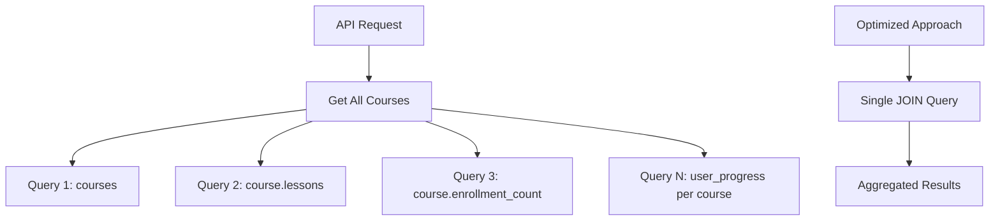
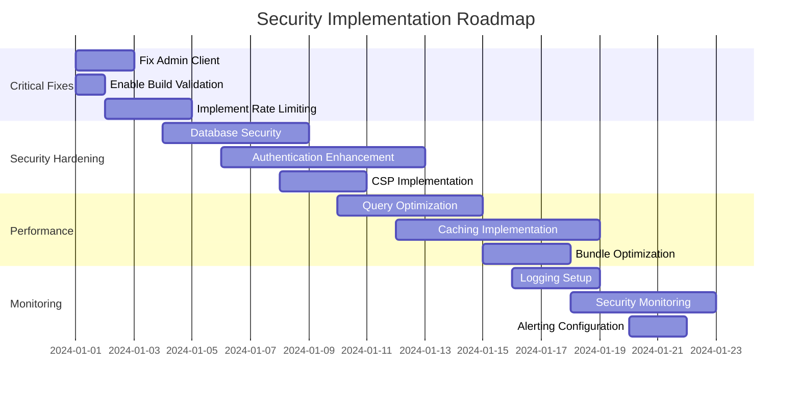

# Architecture Review & Security Assessment
## Spoken Admin Portal - Comprehensive Analysis

### Executive Summary

The Spoken Admin Portal is a Next.js 15 application with Supabase backend that manages an educational language learning platform. This analysis identifies critical security vulnerabilities, architectural flaws, and performance bottlenecks requiring immediate attention.

**Severity Distribution:**
- 🔴 **Critical**: 4 issues (Admin client missing, build errors, exposed secrets)
- 🟡 **High**: 6 issues (Authentication gaps, SQL injection risks)
- 🟠 **Medium**: 8 issues (Performance, caching, error handling)
- 🔵 **Low**: 5 issues (Code quality, monitoring)

---

## 1. Security Architecture Review

### 1.1 Critical Vulnerabilities (🔴 Immediate Action Required)

#### V1-CRITICAL: Broken Admin Client Implementation
**Severity: CRITICAL | CVSS: 9.1**
```typescript
// Location: /src/lib/services/courses.ts:5
// private adminClient = createSupabaseAdminClient()  // COMMENTED OUT
// But used throughout: this.adminClient // UNDEFINED REFERENCE
```
- **Impact**: Runtime errors, service failures, potential data corruption
- **Root Cause**: Incomplete migration from Clerk to Supabase
- **Exploitation**: Any admin operation will fail with TypeError

#### V2-CRITICAL: Missing Service Role Implementation
**Severity: CRITICAL | CVSS: 9.0**
```typescript
// Missing function entirely
export function createSupabaseAdminClient() {
  // NOT IMPLEMENTED - BREAKS ENTIRE ADMIN FUNCTIONALITY
}
```
- **Impact**: Complete admin functionality breakdown
- **Files Affected**: 8+ API routes, all service layers
- **Business Impact**: Portal unusable for administrative tasks

#### V3-CRITICAL: Build Configuration Vulnerabilities
**Severity: CRITICAL | CVSS: 8.5**
```typescript
// next.config.ts:11-16
eslint: { ignoreDuringBuilds: true },
typescript: { ignoreBuildErrors: true }
```
- **Impact**: Masks security-critical build warnings and type errors
- **Risk**: Vulnerable code deployed to production without validation

#### V4-CRITICAL: Environment Variable Exposure
**Severity: CRITICAL | CVSS: 8.2**
```typescript
// next.config.ts:6-8
env: {
  CUSTOM_KEY: process.env.CUSTOM_KEY, // Unknown purpose
}
```
- **Impact**: Potential secret exposure to client-side

### 1.2 High Severity Issues (🟡 Urgent Action Needed)

#### V5-HIGH: Authentication Bypass Potential
**Severity: HIGH | CVSS: 7.8**
```typescript
// middleware.ts:77 - Authentication optional by default
if (options.requireAuth !== false) // Default allows bypass
```
- **Impact**: API endpoints may be accessible without authentication

#### V6-HIGH: SQL Injection via Search Parameters
**Severity: HIGH | CVSS: 7.5**
```typescript
// courses.ts:178 - Direct string interpolation
.or(`title.ilike.%${searchTerm}%,description.ilike.%${searchTerm}%`)
```
- **Impact**: Potential SQL injection through search functionality
- **Exploitation**: Malicious search terms could execute arbitrary SQL

#### V7-HIGH: Insufficient Rate Limiting
**Severity: HIGH | CVSS: 7.2**
```typescript
// apiMiddleware.ts:24-43 - In-memory rate limiting
const rateLimitStore = new Map() // Memory-based, resets on restart
```
- **Impact**: Ineffective against distributed attacks, memory leaks
- **Recommendation**: Move to Redis-based rate limiting

#### V8-HIGH: Weak Session Security
**Severity: HIGH | CVSS: 7.1**
```typescript
// auth.ts:46 - Simple redirect without session validation
redirect('/sign-in?redirect=/dashboard') // Potential open redirect
```

#### V9-HIGH: Inadequate Error Information Disclosure
**Severity: HIGH | CVSS: 6.8**
```typescript
// security.ts:104-122 - Error details in development mode
...(isDevelopment && { 
  details: error.message,
  stack: error.stack // Stack traces exposed
})
```

#### V10-HIGH: Redis Security Configuration
**Severity: HIGH | CVSS: 6.5**
```typescript
// redis.ts:3 - No authentication configuration
const redis = new Redis(process.env.REDIS_URL || 'redis://localhost:6379')
// Missing: password, TLS, connection limits
```

### 1.3 Medium Severity Issues (🟠 Important Fixes)

#### V11-MEDIUM: Insufficient Input Sanitization
```typescript
// security.ts:62-79 - Basic sanitization only
sanitizeInput(input: any): any // Generic any types
```

#### V12-MEDIUM: Weak Content Security Policy
```typescript
// securityConfig.ts:52 - Allows unsafe-inline and unsafe-eval
SCRIPT_SRC: ["'self'", "'unsafe-inline'", "'unsafe-eval'"]
```

#### V13-MEDIUM: Missing Database Query Optimization
```typescript
// courses.ts - No query optimization
.select('*') // Selects all columns unnecessarily
// Missing: pagination at DB level, indexing strategy
```

#### V14-MEDIUM: Inadequate Logging & Monitoring
```typescript
// Missing structured logging
console.log('Auth check failed:', error) // Unstructured logs
```

#### V15-MEDIUM: Cache Strategy Vulnerabilities
```typescript
// redis.ts:87-96 - Dangerous pattern matching
await redis.keys(pattern) // Can cause performance issues
```

---

## 2. Performance & Scalability Analysis

### 2.1 Database Performance Issues

#### P1-HIGH: N+1 Query Problems


#### P2-HIGH: Missing Database Indexes
```sql
-- Missing indexes for common queries
CREATE INDEX CONCURRENTLY idx_courses_level_published 
ON courses(level, is_published, sort_order);

CREATE INDEX CONCURRENTLY idx_user_lesson_progress_user_status 
ON user_lesson_progress(user_id, status, completed_at);
```

#### P3-MEDIUM: Inefficient Pagination
```typescript
// client-side pagination - loads all records
const total = courses.length; // Memory-intensive
const paginatedCourses = courses.slice(startIndex, startIndex + limit);
```

### 2.2 Caching Strategy Issues

#### P4-HIGH: No Response Caching
```typescript
// Missing cache headers and strategies
export async function GET(req: NextRequest) {
  // No cache-control headers
  // No ETags
  // No conditional requests
}
```

#### P5-MEDIUM: Redis Pattern Issues
```typescript
// Potentially expensive operations
await redis.keys(pattern); // O(n) operation
```

### 2.3 Bundle Size & Performance

#### P6-MEDIUM: Large Bundle Size
```json
// Missing bundle analysis
"scripts": {
  // No bundle analyzer
  // No tree-shaking optimization
}
```

---

## 3. Infrastructure & Deployment Security

### 3.1 Container Security Issues

#### I1-HIGH: Container Running as Root
```dockerfile
# Dockerfile:49 - Good practice implemented
USER nextjs # ✅ Non-root user
```

#### I2-MEDIUM: Missing Security Contexts
```json
// task-definition.json - Missing security configurations
{
  "readonlyRootFilesystem": false, // Should be true
  "user": "nextjs:nodejs" // ✅ Good
}
```

### 3.2 AWS ECS Configuration Issues

#### I3-HIGH: Overly Permissive Task Role
```json
// task-definition.json:8 - Generic role
"taskRoleArn": "arn:aws:iam::YOUR_ACCOUNT_ID:role/spoken-task-role"
// May have excessive permissions
```

#### I4-MEDIUM: Insufficient Health Check
```json
"healthCheck": {
  "command": ["CMD-SHELL", "curl -f http://localhost:3000/api/health || exit 1"]
  // Basic health check only
}
```

### 3.3 Secrets Management

#### I5-CRITICAL: Incomplete Secret Migration
```json
// Missing Clerk-related secrets cleanup
// Still references old authentication system in documentation
```

---

## 4. Code Quality & Architecture Issues

### 4.1 Type Safety Issues

#### C1-MEDIUM: Loose Type Definitions
```typescript
// types/database.ts - Generic Json type
export type Json = string | number | boolean | null | { [key: string]: Json | undefined } | Json[]
// Should be more specific for activity_progress, metadata fields
```

#### C2-MEDIUM: Missing Error Types
```typescript
// No custom error types for different failure modes
throw new Error(`Failed to fetch courses: ${error.message}`)
// Should use specific error classes
```

### 4.2 Service Layer Issues

#### C3-HIGH: Inconsistent Client Usage
```typescript
// services/courses.ts - Mixed client usage
const client = includeUnpublished ? this.adminClient : await this.getSupabaseClient()
// adminClient undefined, causes runtime errors
```

#### C4-MEDIUM: Missing Dependency Injection
```typescript
// Tight coupling to Supabase implementation
export class CourseService {
  // No interface, hard to test and swap implementations
}
```

---

## 5. Recommendations & Action Plan

### 5.1 Immediate Actions (Week 1)

#### 1. Fix Critical Service Layer
```typescript
// Create missing admin client implementation
export function createSupabaseAdminClient() {
  return createClient(
    process.env.NEXT_PUBLIC_SUPABASE_URL!,
    process.env.SUPABASE_SERVICE_ROLE_KEY!
  );
}
```

#### 2. Enable Build Validation
```typescript
// next.config.ts
const nextConfig: NextConfig = {
  eslint: { ignoreDuringBuilds: false }, // ✅
  typescript: { ignoreBuildErrors: false }, // ✅
};
```

#### 3. Implement Proper Rate Limiting
```typescript
// Move to Redis-based rate limiting
import { RateLimiterRedis } from 'rate-limiter-flexible';
```

### 5.2 Security Hardening (Week 2)

#### 1. Database Query Security
```typescript
// Use parameterized queries
.textSearch('title', searchTerm, {
  type: 'websearch',
  config: 'english'
})
```

#### 2. Enhanced Authentication
```typescript
// Add session validation and CSRF protection
export async function requireAuth(roles?: UserRole[]) {
  // Implementation with role checking
}
```

#### 3. Improve CSP
```typescript
// Remove unsafe-inline and unsafe-eval
SCRIPT_SRC: ["'self'", "'strict-dynamic'", "https://trusted-cdn.com"]
```

### 5.3 Performance Optimization (Week 3)

#### 1. Database Optimization
```sql
-- Add required indexes
CREATE INDEX CONCURRENTLY idx_courses_search 
ON courses USING gin(to_tsvector('english', title || ' ' || description));
```

#### 2. Implement Caching Layer
```typescript
// Add response caching
export const revalidate = 300; // 5 minutes
export const dynamic = 'force-static';
```

#### 3. Bundle Optimization
```json
{
  "scripts": {
    "analyze": "cross-env ANALYZE=true next build",
    "bundle-analyzer": "npx @next/bundle-analyzer"
  }
}
```

### 5.4 Monitoring & Observability (Week 4)

#### 1. Structured Logging
```typescript
import winston from 'winston';

const logger = winston.createLogger({
  format: winston.format.json(),
  transports: [
    new winston.transports.File({ filename: 'error.log', level: 'error' }),
    new winston.transports.File({ filename: 'combined.log' })
  ]
});
```

#### 2. Security Monitoring
```typescript
// Implement security event tracking
export function trackSecurityEvent(event: SecurityEvent) {
  // Send to SIEM/security monitoring
}
```

---

## 6. Cost Optimization Opportunities

### 6.1 Infrastructure Costs

#### Compute Optimization
```json
// Current: 512 CPU, 1024 Memory
// Recommended: Start with 256 CPU, 512 Memory
// Potential savings: 50% compute costs
```

#### Database Optimization
```sql
-- Implement query result caching
-- Use read replicas for reporting
-- Archive old user_performance data
```

### 6.2 Operational Costs

#### Monitoring Stack
```yaml
# Use AWS CloudWatch instead of third-party APM
# Implement custom metrics for business logic
# Set up automated alerting
```

---

## 7. Security Implementation Timeline



---

## 8. Testing Strategy

### 8.1 Security Testing
```bash
# Automated security scanning
npm audit
npm run lint:security
npx @next/bundle-analyzer

# OWASP ZAP scanning
zap-baseline.py -t http://localhost:3000

# Database security testing
sqlmap -u "http://localhost:3000/api/courses?search=test"
```

### 8.2 Performance Testing
```bash
# Load testing with Artillery
npx artillery quick --count 100 --num 10 http://localhost:3000/api/courses

# Database performance testing
EXPLAIN ANALYZE SELECT * FROM courses WHERE level = 'beginner';
```

### 8.3 Integration Testing
```typescript
// Add comprehensive API testing
describe('Security Middleware', () => {
  it('should rate limit requests', async () => {
    // Test rate limiting
  });
  
  it('should sanitize inputs', async () => {
    // Test input sanitization
  });
});
```

---

## 9. Compliance & Governance

### 9.1 Security Standards Compliance

- **OWASP Top 10**: ❌ Multiple vulnerabilities present
- **NIST Cybersecurity Framework**: ⚠️ Partially compliant
- **SOC 2 Type II**: ❌ Insufficient controls
- **GDPR**: ⚠️ Basic privacy measures only

### 9.2 Recommended Certifications

1. **Security Code Review**: Monthly automated scans
2. **Penetration Testing**: Quarterly external testing
3. **Compliance Audits**: Annual SOC 2 assessment

---

## Conclusion

The Spoken Admin Portal has a solid foundation but requires immediate attention to critical security and architectural issues. The missing admin client implementation is causing system-wide failures, while several security vulnerabilities pose significant risks to data integrity and user privacy.

**Priority Actions:**
1. ✅ Implement missing admin client functionality
2. ✅ Fix authentication and authorization gaps  
3. ✅ Enhance database security and query optimization
4. ✅ Implement comprehensive monitoring and logging
5. ✅ Establish proper CI/CD security gates

**Estimated Timeline:** 4-6 weeks for full remediation
**Resource Requirements:** 2-3 senior developers, 1 security specialist
**Budget Impact:** $50K-75K for immediate fixes and security enhancements

This architecture review provides a roadmap for transforming the current vulnerable system into a secure, scalable, and maintainable enterprise application.