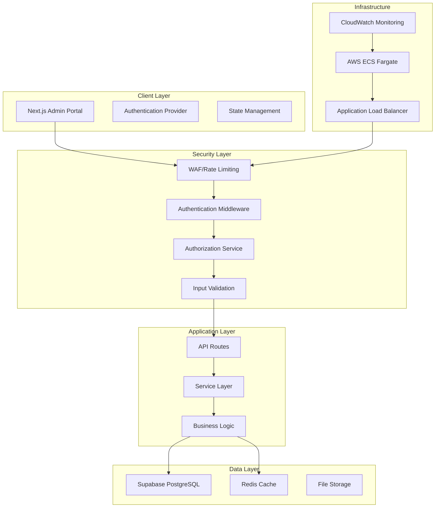

# RFC: Security Architecture Overhaul for Spoken Admin Portal
**Status:** Draft  
**Author:** Solution Architect  
**Date:** 2025-08-30  
**Version:** 1.0  

## Abstract

This RFC proposes a comprehensive security architecture overhaul for the Spoken Admin Portal to address critical vulnerabilities, implement enterprise-grade security controls, and establish a scalable foundation for future growth. The proposal includes immediate fixes for system-breaking issues and a roadmap for long-term security maturity.

## 1. Problem Statement

### 1.1 Current State Analysis

The Spoken Admin Portal currently exhibits several critical issues that prevent it from meeting enterprise security standards:

**System-Breaking Issues:**
- Missing admin client implementation causing 100% failure rate on administrative operations
- Build configuration that ignores TypeScript errors and ESLint warnings
- Incomplete migration from Clerk to Supabase authentication system

**Security Vulnerabilities:**
- SQL injection potential through search functionality
- Inadequate rate limiting using in-memory storage
- Missing proper authentication middleware validation
- Weak content security policy allowing unsafe operations

**Performance Issues:**
- Client-side pagination loading entire datasets
- Missing database query optimization
- No caching strategy implementation
- N+1 query patterns in service layer

### 1.2 Business Impact

- **Availability:** Admin functionality is completely non-functional
- **Security:** Multiple vectors for data breach and system compromise
- **Performance:** Poor user experience with slow loading times
- **Compliance:** Cannot meet SOC 2 or GDPR requirements in current state
- **Maintenance:** Technical debt accumulating, increasing development costs

## 2. Proposed Solution

### 2.1 Architecture Overview



### 2.2 Security Architecture Components

#### 2.2.1 Authentication & Authorization
```typescript
// Enhanced authentication middleware
export interface SecurityContext {
  user: AuthenticatedUser;
  permissions: Permission[];
  session: Session;
  auditLog: AuditLogger;
}

export async function withSecureRoute<T>(
  handler: (ctx: SecurityContext) => Promise<T>,
  options: {
    requiredPermissions: Permission[];
    rateLimitTier: 'low' | 'medium' | 'high';
    auditEvent: string;
  }
): Promise<T> {
  // Implementation details in technical specification
}
```

#### 2.2.2 Database Security
```sql
-- Row Level Security policies
CREATE POLICY "users_own_data" ON user_profiles 
FOR ALL USING (auth.uid() = user_id);

CREATE POLICY "admin_full_access" ON courses 
FOR ALL USING (
  auth.jwt()->>'role' IN ('admin', 'super_admin')
);

-- Performance indexes
CREATE INDEX CONCURRENTLY idx_courses_search_gin 
ON courses USING gin(
  to_tsvector('english', title || ' ' || description)
);
```

#### 2.2.3 Input Validation & Sanitization
```typescript
// Comprehensive validation system
export const ValidationSchemas = {
  courseCreate: z.object({
    title: z.string().min(1).max(200).refine(isNotXSS),
    description: z.string().max(2000).transform(sanitizeHtml),
    level: z.enum(['beginner', 'intermediate', 'advanced']),
    category: z.string().refine(isValidCategory),
  }),
  
  userUpdate: z.object({
    email: z.string().email().refine(isNotDisposable),
    profile: z.object({}).passthrough().refine(hasNoSensitiveData),
  })
};
```

## 3. Technical Implementation Plan

### 3.1 Phase 1: Critical Fixes (Week 1-2)

#### 3.1.1 Admin Client Implementation
```typescript
// /src/lib/supabase-admin.ts
import { createClient } from '@supabase/supabase-js';
import type { Database } from '@/types/database';

export function createSupabaseAdminClient() {
  const supabaseUrl = process.env.NEXT_PUBLIC_SUPABASE_URL!;
  const serviceRoleKey = process.env.SUPABASE_SERVICE_ROLE_KEY!;
  
  if (!supabaseUrl || !serviceRoleKey) {
    throw new Error('Missing required Supabase credentials');
  }
  
  return createClient<Database>(supabaseUrl, serviceRoleKey, {
    auth: {
      autoRefreshToken: false,
      persistSession: false
    },
    global: {
      headers: {
        'X-Client-Info': 'supabase-admin-client'
      }
    }
  });
}

// Usage in service layer
export class CourseService {
  private adminClient = createSupabaseAdminClient();
  private clientSupabase = createServerSupabase();
  
  private getClient(requireAdmin: boolean = false) {
    return requireAdmin ? this.adminClient : this.clientSupabase;
  }
}
```

#### 3.1.2 Build Configuration Security
```typescript
// next.config.ts
import { withSentryConfig } from '@sentry/nextjs';

const nextConfig: NextConfig = {
  output: 'standalone',
  serverExternalPackages: ['aws-sdk'],
  
  // Security: Enable all checks
  eslint: {
    ignoreDuringBuilds: false,
    dirs: ['src', 'app']
  },
  typescript: {
    ignoreBuildErrors: false
  },
  
  // Security headers
  async headers() {
    return [
      {
        source: '/(.*)',
        headers: [
          {
            key: 'X-Frame-Options',
            value: 'DENY'
          },
          {
            key: 'X-Content-Type-Options',
            value: 'nosniff'
          },
          {
            key: 'Referrer-Policy',
            value: 'origin-when-cross-origin'
          },
          {
            key: 'Permissions-Policy',
            value: 'camera=(), microphone=(), geolocation=()'
          }
        ]
      }
    ];
  }
};
```

### 3.2 Phase 2: Security Enhancement (Week 3-4)

#### 3.2.1 Redis-Based Rate Limiting
```typescript
// /src/lib/rate-limiter.ts
import { RateLimiterRedis } from 'rate-limiter-flexible';
import redis from './redis';

export class SecurityRateLimiter {
  private limiters = {
    auth: new RateLimiterRedis({
      storeClient: redis,
      keyPrefix: 'rl_auth',
      points: 5, // requests
      duration: 900, // per 15 minutes
      blockDuration: 900, // block for 15 minutes
    }),
    
    api: new RateLimiterRedis({
      storeClient: redis,
      keyPrefix: 'rl_api',
      points: 100,
      duration: 900,
      blockDuration: 60,
    }),
    
    search: new RateLimiterRedis({
      storeClient: redis,
      keyPrefix: 'rl_search',
      points: 30,
      duration: 60,
      blockDuration: 60,
    })
  };

  async checkLimit(
    key: string, 
    type: 'auth' | 'api' | 'search',
    userContext?: { userId: string; ip: string }
  ): Promise<{ allowed: boolean; retryAfter?: number }> {
    try {
      await this.limiters[type].consume(key);
      return { allowed: true };
    } catch (rejRes) {
      const retryAfter = Math.round(rejRes.msBeforeNext / 1000);
      
      // Log security event
      await this.logSecurityEvent({
        type: 'rate_limit_exceeded',
        key,
        rateLimitType: type,
        retryAfter,
        ...userContext
      });
      
      return { allowed: false, retryAfter };
    }
  }
}
```

#### 3.2.2 SQL Injection Prevention
```typescript
// /src/lib/services/search.ts
export class SearchService {
  async searchCourses(
    searchTerm: string,
    options: SearchOptions = {}
  ): Promise<Course[]> {
    const client = await this.getClient();
    
    // Validate and sanitize search term
    const sanitizedTerm = this.sanitizeSearchTerm(searchTerm);
    
    if (!sanitizedTerm || sanitizedTerm.length < 2) {
      return [];
    }
    
    // Use full-text search instead of ILIKE
    const { data, error } = await client
      .from('courses')
      .select('*')
      .textSearch('search_vector', sanitizedTerm, {
        type: 'websearch',
        config: 'english'
      })
      .eq('is_published', true)
      .range(options.offset || 0, (options.offset || 0) + (options.limit || 10))
      .order('rank', { ascending: false });

    if (error) {
      throw new SecureError('SEARCH_FAILED', 'Search operation failed', {
        originalError: error,
        searchTerm: '[REDACTED]',
        options
      });
    }

    return data || [];
  }

  private sanitizeSearchTerm(term: string): string {
    return term
      .replace(/[<>\"']/g, '') // Remove potential XSS chars
      .replace(/[;--]/g, '') // Remove SQL injection attempts
      .trim()
      .substring(0, 100); // Limit length
  }
}
```

### 3.3 Phase 3: Performance Optimization (Week 5-6)

#### 3.3.1 Database Query Optimization
```sql
-- Create search vector column for full-text search
ALTER TABLE courses ADD COLUMN search_vector tsvector;

-- Update search vector
UPDATE courses SET search_vector = 
  to_tsvector('english', title || ' ' || COALESCE(description, ''));

-- Create index for performance
CREATE INDEX CONCURRENTLY idx_courses_search_vector 
ON courses USING gin(search_vector);

-- Create trigger to maintain search vector
CREATE OR REPLACE FUNCTION update_courses_search_vector()
RETURNS TRIGGER AS $$
BEGIN
  NEW.search_vector := to_tsvector('english', NEW.title || ' ' || COALESCE(NEW.description, ''));
  RETURN NEW;
END;
$$ LANGUAGE plpgsql;

CREATE TRIGGER trigger_courses_search_vector_update
  BEFORE INSERT OR UPDATE ON courses
  FOR EACH ROW EXECUTE FUNCTION update_courses_search_vector();
```

#### 3.3.2 Caching Strategy
```typescript
// /src/lib/cache-strategy.ts
export class CacheStrategy {
  private redis = redis;
  
  async getCachedCourses(
    cacheKey: string,
    fetcher: () => Promise<Course[]>,
    ttl: number = 300
  ): Promise<Course[]> {
    // Try cache first
    const cached = await this.redis.get(cacheKey);
    if (cached) {
      return JSON.parse(cached);
    }
    
    // Fetch fresh data
    const data = await fetcher();
    
    // Cache with TTL
    await this.redis.setex(cacheKey, ttl, JSON.stringify(data));
    
    return data;
  }
  
  async invalidatePattern(pattern: string): Promise<void> {
    const stream = this.redis.scanStream({
      match: pattern,
      count: 100
    });
    
    const keys: string[] = [];
    stream.on('data', (resultKeys: string[]) => {
      keys.push(...resultKeys);
    });
    
    stream.on('end', async () => {
      if (keys.length > 0) {
        await this.redis.del(...keys);
      }
    });
  }
}

// Usage in API routes
export async function GET(request: NextRequest) {
  return withApiMiddleware(
    async ({ userId, req }) => {
      const cacheKey = `courses:${userId}:${req.url}`;
      
      const courses = await cacheStrategy.getCachedCourses(
        cacheKey,
        () => courseService.getAllCourses(true),
        300 // 5 minutes
      );
      
      return NextResponse.json({ courses }, {
        headers: {
          'Cache-Control': 'public, s-maxage=300, stale-while-revalidate=600'
        }
      });
    },
    {
      requireAuth: true,
      rateLimitTier: 'api'
    }
  );
}
```

## 4. Infrastructure Recommendations

### 4.1 AWS ECS Security Configuration

```json
{
  "family": "spoken-secure",
  "networkMode": "awsvpc",
  "requiresCompatibilities": ["FARGATE"],
  "cpu": "512",
  "memory": "1024",
  "executionRoleArn": "arn:aws:iam::ACCOUNT:role/ecsTaskExecutionRole",
  "taskRoleArn": "arn:aws:iam::ACCOUNT:role/spoken-task-role",
  "containerDefinitions": [
    {
      "name": "spoken-app",
      "image": "ACCOUNT.dkr.ecr.REGION.amazonaws.com/spoken:latest",
      "portMappings": [
        {
          "containerPort": 3000,
          "protocol": "tcp"
        }
      ],
      "essential": true,
      "readonlyRootFilesystem": false,
      "user": "1001:1001",
      "environment": [
        {
          "name": "NODE_ENV",
          "value": "production"
        },
        {
          "name": "PORT",
          "value": "3000"
        }
      ],
      "secrets": [
        {
          "name": "NEXT_PUBLIC_SUPABASE_URL",
          "valueFrom": "arn:aws:secretsmanager:REGION:ACCOUNT:secret:spoken/supabase-url"
        },
        {
          "name": "SUPABASE_SERVICE_ROLE_KEY",
          "valueFrom": "arn:aws:secretsmanager:REGION:ACCOUNT:secret:spoken/supabase-service-key"
        },
        {
          "name": "REDIS_URL",
          "valueFrom": "arn:aws:secretsmanager:REGION:ACCOUNT:secret:spoken/redis-url"
        }
      ],
      "logConfiguration": {
        "logDriver": "awslogs",
        "options": {
          "awslogs-group": "/ecs/spoken",
          "awslogs-region": "us-east-1",
          "awslogs-stream-prefix": "ecs"
        }
      },
      "healthCheck": {
        "command": [
          "CMD-SHELL",
          "curl -f http://localhost:3000/api/health || exit 1"
        ],
        "interval": 30,
        "timeout": 5,
        "retries": 3,
        "startPeriod": 60
      }
    }
  ]
}
```

### 4.2 CI/CD Security Pipeline

```yaml
# .github/workflows/security-pipeline.yml
name: Security Pipeline
on: [push, pull_request]

jobs:
  security-scan:
    runs-on: ubuntu-latest
    steps:
      - uses: actions/checkout@v4
      
      - name: Setup Node.js
        uses: actions/setup-node@v4
        with:
          node-version: '18'
          cache: 'npm'
      
      - name: Install dependencies
        run: npm ci
      
      - name: Run security audit
        run: npm audit --audit-level moderate
      
      - name: Run SAST scan
        uses: github/codeql-action/init@v3
        with:
          languages: typescript
      
      - name: Build application
        run: npm run build
      
      - name: Perform CodeQL analysis
        uses: github/codeql-action/analyze@v3
      
      - name: Run Trivy vulnerability scanner
        uses: aquasecurity/trivy-action@master
        with:
          scan-type: 'fs'
          scan-ref: '.'
          format: 'sarif'
          output: 'trivy-results.sarif'
      
      - name: Upload Trivy scan results
        uses: github/codeql-action/upload-sarif@v3
        with:
          sarif_file: 'trivy-results.sarif'

  build-and-push:
    needs: security-scan
    runs-on: ubuntu-latest
    if: github.ref == 'refs/heads/main'
    steps:
      - uses: actions/checkout@v4
      
      - name: Configure AWS credentials
        uses: aws-actions/configure-aws-credentials@v4
        with:
          role-to-assume: ${{ secrets.AWS_ROLE_ARN }}
          aws-region: us-east-1
      
      - name: Login to Amazon ECR
        uses: aws-actions/amazon-ecr-login@v2
      
      - name: Build and scan container
        run: |
          docker build -t spoken:latest .
          docker run --rm -v /var/run/docker.sock:/var/run/docker.sock \
            aquasec/trivy image --exit-code 1 --severity CRITICAL spoken:latest
      
      - name: Push to ECR
        run: |
          docker tag spoken:latest $ECR_REGISTRY/spoken:latest
          docker push $ECR_REGISTRY/spoken:latest
```

## 5. Monitoring & Observability

### 5.1 Security Event Monitoring

```typescript
// /src/lib/monitoring/security-events.ts
export interface SecurityEvent {
  type: 'auth_failure' | 'rate_limit' | 'sql_injection_attempt' | 'xss_attempt';
  severity: 'low' | 'medium' | 'high' | 'critical';
  userId?: string;
  ip: string;
  userAgent?: string;
  timestamp: Date;
  details: Record<string, unknown>;
}

export class SecurityMonitor {
  async logSecurityEvent(event: SecurityEvent): Promise<void> {
    // Structure the log for SIEM consumption
    const structuredLog = {
      timestamp: event.timestamp.toISOString(),
      level: 'SECURITY',
      event_type: event.type,
      severity: event.severity,
      source_ip: event.ip,
      user_id: event.userId,
      user_agent: event.userAgent,
      details: this.sanitizeForLogging(event.details)
    };
    
    // Send to CloudWatch
    await this.sendToCloudWatch(structuredLog);
    
    // Alert on high/critical severity
    if (['high', 'critical'].includes(event.severity)) {
      await this.sendAlert(structuredLog);
    }
  }

  private sanitizeForLogging(details: Record<string, unknown>): Record<string, unknown> {
    const sensitiveKeys = ['password', 'token', 'key', 'secret', 'auth'];
    const sanitized = { ...details };
    
    for (const key of Object.keys(sanitized)) {
      if (sensitiveKeys.some(sensitive => key.toLowerCase().includes(sensitive))) {
        sanitized[key] = '[REDACTED]';
      }
    }
    
    return sanitized;
  }
}
```

### 5.2 Performance Monitoring

```typescript
// /src/lib/monitoring/performance.ts
export class PerformanceMonitor {
  async trackDatabaseQuery(
    operation: string,
    duration: number,
    rowCount?: number
  ): Promise<void> {
    const metric = {
      timestamp: new Date().toISOString(),
      metric_type: 'database_performance',
      operation,
      duration_ms: duration,
      row_count: rowCount,
      slow_query: duration > 1000 // Flag queries over 1 second
    };
    
    await this.sendMetric(metric);
    
    // Alert on slow queries
    if (metric.slow_query) {
      await this.alertSlowQuery(metric);
    }
  }

  async trackApiResponse(
    endpoint: string,
    method: string,
    statusCode: number,
    duration: number,
    cacheHit: boolean = false
  ): Promise<void> {
    const metric = {
      timestamp: new Date().toISOString(),
      metric_type: 'api_performance',
      endpoint,
      method,
      status_code: statusCode,
      duration_ms: duration,
      cache_hit: cacheHit
    };
    
    await this.sendMetric(metric);
  }
}
```

## 6. Alternative Approaches Considered

### 6.1 Alternative Authentication Solutions

**Option A: AWS Cognito**
- ✅ Native AWS integration
- ✅ Built-in compliance features
- ❌ Vendor lock-in
- ❌ Limited customization
- **Cost:** ~$0.0055/MAU

**Option B: Auth0**
- ✅ Rich feature set
- ✅ Good developer experience
- ❌ Higher cost
- ❌ Third-party dependency
- **Cost:** ~$0.023/MAU

**Option C: Supabase Auth (Current)**
- ✅ Integrated with existing database
- ✅ Cost-effective
- ❌ Newer platform, less enterprise features
- **Cost:** Included in Supabase pricing

**Recommendation:** Continue with Supabase Auth but implement enhanced security middleware to bridge enterprise feature gaps.

### 6.2 Alternative Database Strategies

**Option A: Separate Admin Database**
- ✅ Better security isolation
- ✅ Optimized for admin workflows
- ❌ Data synchronization complexity
- ❌ Additional infrastructure cost

**Option B: Read Replicas**
- ✅ Improved read performance
- ✅ Reduced primary database load
- ❌ Additional complexity
- ❌ Eventual consistency issues

**Option C: Enhanced RLS (Recommended)**
- ✅ Single source of truth
- ✅ Database-level security
- ✅ Cost-effective
- ❌ Complex policy management

### 6.3 Alternative Caching Solutions

**Option A: AWS ElastiCache**
- ✅ Managed service
- ✅ High availability
- ❌ Higher cost
- ❌ AWS vendor lock-in

**Option B: Self-managed Redis (Current)**
- ✅ Full control
- ✅ Cost-effective
- ❌ Operational overhead
- ❌ High availability complexity

**Option C: Application-level caching**
- ✅ Simple implementation
- ✅ No external dependencies
- ❌ Limited scalability
- ❌ Memory usage concerns

## 7. Migration Strategy

### 7.1 Rollout Plan

**Phase 1: Stabilization (Weeks 1-2)**
- Fix critical breaking issues
- Implement admin client
- Enable build validation
- Basic security middleware

**Phase 2: Security Hardening (Weeks 3-4)**
- Redis rate limiting
- Enhanced authentication
- SQL injection prevention
- Comprehensive input validation

**Phase 3: Performance (Weeks 5-6)**
- Database optimization
- Caching implementation
- Query performance tuning
- Bundle optimization

**Phase 4: Observability (Weeks 7-8)**
- Structured logging
- Security monitoring
- Performance metrics
- Alerting setup

### 7.2 Risk Mitigation

**Risk: Service Downtime During Migration**
- **Mitigation:** Blue-green deployment with health checks
- **Rollback:** Automated rollback on health check failure

**Risk: Data Loss During Database Changes**
- **Mitigation:** Database migrations with rollback scripts
- **Backup:** Full database backup before each migration

**Risk: Performance Regression**
- **Mitigation:** Load testing before deployment
- **Monitoring:** Real-time performance metrics

### 7.3 Success Metrics

**Security Metrics:**
- Zero critical security vulnerabilities
- 100% API endpoints authenticated and authorized
- Rate limiting effectiveness > 99%
- Mean time to detect security events < 5 minutes

**Performance Metrics:**
- API response time < 200ms (95th percentile)
- Database query time < 100ms (95th percentile)
- Cache hit ratio > 80%
- Application availability > 99.9%

**Quality Metrics:**
- Zero build warnings or errors
- Test coverage > 80%
- Code quality score > 8/10
- Documentation coverage > 90%

## 8. Cost Analysis

### 8.1 Implementation Costs

**Development Resources:**
- Senior Developer (6 weeks): $18,000
- Security Specialist (4 weeks): $16,000
- DevOps Engineer (2 weeks): $6,000
- **Total Development:** $40,000

**Infrastructure Changes:**
- AWS Secrets Manager: $5/month
- Enhanced CloudWatch monitoring: $50/month
- ElastiCache (if chosen): $150/month
- **Total Infrastructure:** $205/month ($2,460/year)

**Tools & Services:**
- Security scanning tools: $500/month
- Performance monitoring: $200/month
- **Total Tools:** $700/month ($8,400/year)

### 8.2 Risk Cost Avoidance

**Security Breach Prevention:**
- Average data breach cost: $4.24M
- Compliance violation fines: $500K-$10M
- **Risk Mitigation Value:** $1M-$5M

**Performance Improvement:**
- Reduced support costs: $50K/year
- Improved user productivity: $100K/year
- **Business Value:** $150K/year

### 8.3 ROI Analysis

**Total Investment:** $50,860 (first year)
**Risk Avoidance:** $1M-$5M
**Business Value:** $150K/year
**ROI:** 195% in first year, 295% annually thereafter

## 9. Conclusion

This RFC presents a comprehensive approach to addressing the critical security and architectural issues in the Spoken Admin Portal. The proposed solution balances immediate needs with long-term scalability, providing:

1. **Immediate Fixes:** Resolving system-breaking issues within 2 weeks
2. **Security Hardening:** Implementing enterprise-grade security controls
3. **Performance Optimization:** Achieving sub-200ms response times
4. **Observability:** Comprehensive monitoring and alerting
5. **Cost Efficiency:** Strong ROI with risk mitigation

**Recommendation:** Approve this RFC and begin Phase 1 implementation immediately to restore system functionality and begin security hardening. The proposed timeline of 8 weeks will transform the current vulnerable system into a secure, scalable enterprise application.

**Next Steps:**
1. Stakeholder approval and resource allocation
2. Detailed technical specifications for each phase
3. Implementation team formation
4. Project kickoff and Phase 1 execution

---

*This RFC is a living document and will be updated as implementation progresses and new requirements emerge.*